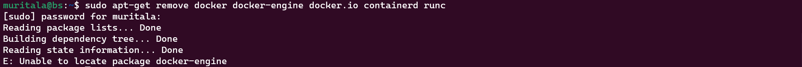

# General Security

## 1. **Prerequisites:**

**OS requirements:** To install Docker Engine, you need the 64-bit version of Ubuntu.

**Uninstall old versions:** Uninstall any older versions before attempting to install a new one.

```bash
sudo apt-get remove docker docker-engine docker.io containerd runc
```

If no older version is present, below is the output:



## 2. **Installation using the repository**

Before installing Docker Engine on a new host machine for the first time, you must set up the Docker repository. Afterward, you can install and update Docker from the repository. 

- Update the `apt` package index and install packages to allow `apt` to use a repository over HTTPS:

```bash
sudo apt-get update
sudo apt-get install \
    ca-certificates \
    curl \
    gnupg \
    lsb-release
```

- Add Docker’s official GPG key:

```bash
sudo mkdir -m 0755 -p /etc/apt/keyrings
curl -fsSL https://download.docker.com/linux/ubuntu/gpg | sudo gpg --dearmor -o /etc/apt/keyrings/docker.gpg
```

- Use the following command to set up the repository:

```bash
echo \
  "deb [arch=$(dpkg --print-architecture) signed-by=/etc/apt/keyrings/docker.gpg] https://download.docker.com/linux/ubuntu \
  $(lsb_release -cs) stable" | sudo tee /etc/apt/sources.list.d/docker.list > /dev/null
```

## 3. **Install Docker Engine**

- Update the `apt` package index to refresh the apt cache:

```bash
sudo apt-get update
```

- Receiving a GPG error when running `apt-get update`?

```bash
sudo chmod a+r /etc/apt/keyrings/docker.gpg
sudo apt-get update
```

- Selecting the docker repository as the default one

```bash
apt-cache policy docker-ce
```

- Install Docker Engine, containerd, and Docker Compose.

```bash
sudo apt-get install docker-ce docker-ce-cli containerd.io docker-buildx-plugin docker-compose-plugin
```

- Check the status of the Docker

```bash
sudo systemctl status docker
```


- Add current user `muritala` to the Docker group to be able to run the docker command.

```bash
sudo usermod -aG docker muritala
```

- Log out and then in for a change to take effect.

```bash
exit
```

- After logging in, check the docker version to check if the docker client can talk to the docker daemon or server.

```bash
docker --version
```


### Reference: [https://docs.docker.com/engine/install/ubuntu/](https://docs.docker.com/engine/install/ubuntu/)