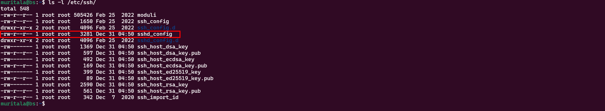

# Securing the OpenSSH Server

Secure remote access is essential for many organizations, and SSH has become the de-facto standard for this purpose. However, a default SSH installation may not be the most secure option, leaving the server vulnerable to cyber attacks. Fortunately, a few simple steps can dramatically improve SSH security.

In this project, we will show you how to secure the open ssh server, enhancing its security and protecting against unauthorized access.

1. Install `OpenSSH` client
    
    ```bash
    sudo apt update && sudo apt install openssh-server openssh-client 
    ```
    
2. Connect to the server using `ssh -p 22 username@server_ip`. For example, conecting with username `muritala` , IP address `192.168.10.23`, and port `22`
    
    ```bash
    ssh -p 22 muritala@192.168.10.23
    ```
    
3. Controlling the `SSHd` daemon to check its status, stopping, restarting, and enabling at boot time.
    
    Check `ssh`status
    
    ```bash
    sudo systemctl status ssh
    ```
    
    Stop `ssh`
    
    ```bash
    sudo systemctl stop ssh
    ```
    
    Restart `ssh`
    
    ```bash
    sudo systemctl restart ssh
    ```
    
    Enable `ssh` at boot
    
    ```bash
    sudo systemctl enable ssh
    ```
    
4. The server configuration file is located in `/etc/ssh/`, and it’s called `sshd_config`
    
    ```bash
    ls -l /etc/ssh/
    ```
    
    
    
5. To enhance security, using a non-standard port such as `2279` for the Linux server as the default port; attackers commonly target port `22`. However, it is essential to note that using a non-standard port alone is not enough to secure the server as it is considered a form of security through obscurity. Changing the port does not provide complete protection as determined hackers can still scan all ports using tools like `nmap`. Nonetheless, a non-standard port is highly recommended, as it can deter automated attacks on the Linux server. To implement changes related to the server, you need to edit the `sshd_config` file and restart the server for the changes to take effect. 
    
    ```bash
    sudo vim /etc/ssh/sshd_config
    ```
    
    Type `i` to switch into insert mode in `vim`, `esc,` and`:wq` to save and exit your file. Uncomment `#`each line with changes to apply non-default settings.
    
    
    
6. Direct login as root through `ssh` is a system's most dangerous security vulnerability. Even with a strong root password, there is always a possibility that a hacker can find it using brute force attacks. Avoiding direct root login via `ssh` is recommended to mitigate this risk. Instead, log in as a regular user and use the `sudo` or `su` commands to run commands as root when necessary. This approach improves the system’s overall security and reduces the likelihood of successful attacks. Search for `PermitRootlogin` to verify it is disabled by default and change it from `prohibit-password` to `no`.
    
    
    
7. Limiting `ssh` access for users who do not require remote system access can greatly improve the system's overall security. By default, all system users can log in via SSH using their password or public key, which increases the risk of unauthorized access. Adding the `AllowUsers` option to the `sshd_config` file and specifying a list of allowed users can limit the impact of a weak password, enhancing the system's overall security. It is important to note that the `AllowUsers` option may not be present in the `sshd_config` file by default and must be added manually. Add `muritala` as the only permitted `ssh` user.
    
    
    
8. To further enhance the system’s security, it is advisable to restrict access to the `ssh` port only from a limited list of source IP addresses. This can be achieved by configuring the firewall rules, `iptables` to permit connections only from the known IP addresses of the system administrators who require remote access. This approach limits the risk of unauthorized access to the system, particularly in cases where the source IP address is `static`. In situations where the source IP address is `dynamic` or subject to change, permitting access to the entire network may be necessary to prevent disruptions to remote access.
    
    Configuring the `iptables` to only allow remote connection from `ssh` port `2279` and IP address `192.168.10.22`
    
    ```bash
    sudo iptables -A INPUT -p tcp --dport 2279 -s 192.168.10.22 -j ACCEPT
    ```
    
    Drop all other `ssh` connections to the Linux system using:
    
    ```bash
    sudo iptables -A INPUT -p tcp --dport 2279 -j DROP
    ```
    
9. By default, the latest versions of OpenSSH use SSH protocol version 2, so there's no need to change anything. However, it's advisable to configure an `idle timeout interval.` Set `ClientAliveInterval` to `300` and `ClientAliveountMax` to `0` and remove the comment `#`
    
    
    
10. Public key authentication must be set between the client and server by generating an `ssh-id` before activating public key Authentication by setting it to `yes` and Disable Password Authentication by setting it to `no`. Remember to remove the comment `#`
    
    