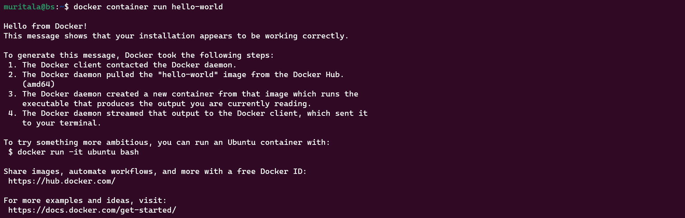

# The Docker Client

## 1. Testing the entire installation

```bash
docker --version 
docker version
docker info

```

- Verify that the Docker Engine installation is successful by running the `hello-world`
 image:

```bash
sudo docker run hello-world
```



## 2. Getting help

```bash
docker help
```

- Getting help on management commands like `container`

```bash
docker container help
```

## 3. Searching and Pulling Images from the Docker hub

- Searching for an image on Docker Hub. Images like `debian and mongo`

```bash
docker search debian
docker search mongo
```

- Pulling an image from the docker hub. Pull images such as `redis:5.0.10 , ubuntu:latest, mysql`

```bash
docker image pull redis:5.0.10 
docker image pull ubuntu:latest
docker image pull mysql        
```


## 4. Checking and Listing local images

```bash
docker images
```


```bash
docker image ls
```


## 5. Running Containers

- Running a Container such as `httpd`. If the docker image is unavailable locally, it will be downloaded from Docker Hub.

```bash
docker container run -it httpd
```

- Detach the container from the screen using `Ctrl+P+Q`
- List running Docker container

```bash
docker container ls
```

