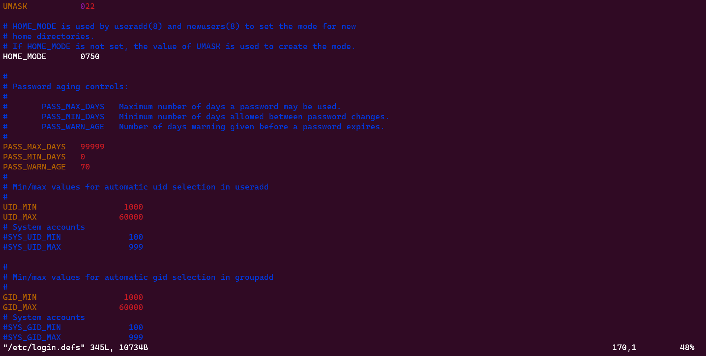

# Enforcing Password Policy

Let's discuss the implementation of password policies in Linux, as the security of the system heavily relies on the strength of user passwords. A password policy comprises a set of regulations that users must adhere to. Typically, these rules outline the password's expiration duration, length, complexity, the maximum number of login attempts, and whether it's acceptable to reuse previous passwords. The settings for password aging and length are crucial components of password policies.

1. Modify password settings:
    
    ```bash
    sudo vim /etc/login.defs
    ```
    
    
    
    Add a new line, `PASS_MIN_LEN    10` below the `PASS_WARN_AGE`
    
    
    
2. Add a  new user with a username `test`, set password `**********,` the password to expire in 90 days, and list the user password expiration details.
    
    ```bash
    sudo useradd -m -d /home/test -s /bin/bash test && sudo passwd test && sudo chage -M 90 test && sudo chage -l test
    ```
    
    
    
3. Typically, a strong password should contain a blend of uppercase letters, lowercase letters, numbers, and special characters, and its length should be no less than ten characters. Pluggable Authentication Modules (PAM) enforce password complexity across many Linux distributions. The configuration file for this purpose is located at `/etc/pam.d/common-password` in Ubuntu
    
    ```bash
    ls -l /etc/pam.d/common-password
    ```
    
    
    
    ```bash
    sudo apt install libpam-pwquality
    ```
    
    Install PAM package:
    
    Open the `common-password` file in `vim` and locate `password requisite pam_pwquality.so retry=3` line.
    
    ```bash
    sudo vim /etc/pam.d/common-password
    ```
    
    
    
    Add the following attributes `minlen=8 diffok=3 ucredit=-1 lcredit=-1 dcredit=-1 ocredit=-1` to the line. These parameters enforce specific password requirements. The `retry=3` attribute prompts the user three times before exiting and generating an error. The `minlen=8` attribute specifies that the password must be at least eight characters long. `difok=3` mandates that the new password can have a maximum of three characters different from the old password. The `ucredit=-1` option requires the inclusion of at least one uppercase character in the password, while the `lcredit=-1` option necessitates at least one lowercase character. Using the `dcredit=-1` option implies that the password must include at least one numeric character, while the `ocredit=-1` option requires including at least one special character.
    
    
    
    login as user `test`
    
    ```bash
    su test
    ```
    
    Verify the password complexity is working and Change the password
    
    ```bash
    passwd
    ```
    
    