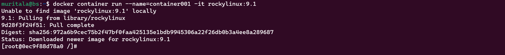

# Getting Shell Access to a Container

## 1. Run a Container

- Running a container, `rockylinux:9.1`, give it the name `container001`, and use the `-i` interactive and `-t` tty options to allocate a terminal with root access to install other programs or make changes.
    
    ```bash
    docker container run --name=container001 -it rockylinux:9.1
    ```
    
    
    
- Install a program `nmap` and exit without killing the container using `Crtl + P + Q`
    
    ```bash
    yum install nmap
    ```
    

## 2. Get a Bash Shell in a Running Container

- List actively running containers
    
    ```bash
    docker container ls
    ```
    
    
    
- Gain shell access to the container, `container001`
    
    ```bash
    docker container exec -it container001 /bin/bash
    ```
    
- Stop the running container, `container001`.
    
    ```bash
    docker container stop container001
    ```
    

## 3. Execute Commands in a Container

- For Linux distribution, bash is the default command. Start a `debian` in a container with shell access.
    
    ```bash
    docker container run -it debian
    ```
    
    
    
- Run `ls` command
    
    
    
- View the content of the `passwd` file.
    
    ```bash
    cat /etc/passwd
    ```
    
    
    
- Find the container IP address.
    
    ```bash
    hostname -I
    ```
    
    
    
- Exit the container
    
    ```bash
    exit
    ```
    

## 3. Execute Commands Without Getting Shell Access

- Start the container, `sad_bouman` by first checking the exited container list using:
    
    ```bash
    docker container ls -a
    ```
    
    
    
    ```bash
    docker container start sad_bouman
    ```
    
    
    
- Check actively running container(s)
    
    ```bash
    docker container ls
    ```
    
    
    
- Get shell access and exit without killing the container using `Crtl + P + Q`
    
    ```bash
    docker container exec -it sad_bouman bash
    ```
    
    
    
- Execute commands in the container `d6c592c8b91b` , without getting shell access.
    
    ```bash
    docker container exec d6c592c8b91b cat /etc/shadow
    ```
    
    
    
- Execute the `update` command.
    
    ```bash
    docker container exec d6c apt update
    ```
    
    
    

## 4. Getting Information about the Running Containers.

- List all running and stopped containers
    
    ```bash
    docker container ls -a
    ```
    
    
    
- Remove all containers quietly.
    
    ```bash
    docker container rm -f $(docker container ls -a -q)
    ```
    
    
    
    ```bash
    docker container ls -a
    ```
    
    
    
- Start an `nginx` server.
    
    ```bash
    docker container run -d -p 8080:80 --name=mysite nginx
    ```
    
    
    
    
    
- View all running container.
    
    ```bash
    docker container ls -a
    ```
    
    
    
- View the container, `mysite`, port.
    
    ```bash
    docker container port mysite
    ```
    
    
    
- View container, `mysite` logs
    
    ```bash
    docker container logs mysite
    ```
    
    
    
    
    
- View real-time log updates.
    
    ```bash
    docker container logs -f mysite
    ```
    
- View all the processes running in a container
    
    ```bash
    docker container top mysite
    ```
    
    
    
- Or use `ps` command to view the processes.
    
    ```bash
    ps -ef | grep nginx
    ```
    
    
    
- Display Real-time information about running container(s)
    
    ```bash
    docker container stats
    ```
    
    
    
- View detailed information about a container using the `inspect` command and filter to see specific information, such as the container’s private IP address.
    
    ```bash
    docker container inspect mysite | grep -i ipaddress
    ```
    
    
    
- Ping the private IP address, `172.17.0.2`.
    
    ```bash
    ping 172.17.0.2
    ```
    
    