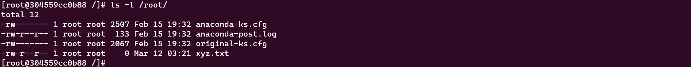

# Modifying a Container

## 1. Committing Container Changes into a New Image

- Start a `rockylinux` container
    
    ```bash
    docker container run -it --name=container1 rockylinux:9.1
    ```
    
- Create a new file `xyz.txt`.
    
    ```bash
    touch /root/xyz.txt
    ```
    
- List the root directory to view the newly created file.
    
    ```bash
    ls -l /root/
    ```
    
    
    
- Install `nmap` scanner
    
    ```bash
    yum install nmap
    ```
    
- Use `nmap` to scan port `80` on `scanme.nmap.org`
    
    ```bash
    nmap -p 80 scanme.nmap.org
    ```
    
    
    
- Exit the container and view all containers.
    
    ```bash
    exit
    ```
    
    ```bash
    docker container ls -a
    ```
    
    
    
- Start another `rockylinux` container.
    
    ```bash
    docker container run -it --name=container2 rockylinux:9.1
    ```
    
- Check the root folder on `container2` for files from `container1`.
    
    ```bash
    ls /root/
    ```
    
    
    
- Check for `nmap` package from `container1` on `container2`.
    
    
    
- Exit `container2`
    
    ```bash
    exit
    ```
    
- Start  `container1`
    
    
    
    ```bash
    docker container start container1
    ```
    
- Get shell access, make changes to the container, and then exit.
    
    ```bash
    docker container exec -it container1 bash
    ```
    
- Commit the exited container, `container1`, with container_id `304`
    
    ```bash
    docker commit -m nmap-installed -a muritala 304 molanre/my_rockylinux
    ```
    
    
    
- View image available on the local machine.
    
    ```bash
    docker image ls
    ```
    
    
    
- Start a new container from the saved container image , `molanre/my_rockylinux`.
    
    ```bash
    docker container run -it molanre/my_rockylinux
    ```
    
    
    
- Check for the previously installed program, `nmap`, and file, `xyz.txt`.
    
    ```bash
    ls /root/ && nmap
    ```
    
    
    

## 2. Tagging and Pushing Custom Images to Docker Hub

- View all available images on the local machine
    
    ```bash
    docker image ls
    ```
    
    
    
- Tagging docker images to create a custom image. Tagging images like `nginx` with your repository and custom name, `molanre/nginx:custom`.
    
    ```bash
    docker image tag nginx molanre/nginx:custom && docker image ls
    ```
    
    
    
- Adding a new tag, `1.0`, to the saved image, `my_rockylinux` and list all images on local machine.
    
    ```bash
    docker image tag molanre/my_rockylinux:latest molanre/my_rockylinux:1.0 && docker image ls
    ```
    
    
    
- Pushing an image, `molanre/my_rockylinux:latest` to Docker Hub by creating an account or logging in and run docker push. Logging in to Docker Hub on the terminal with username, `molanre` and password, `**********.`
    
    ```bash
    docker login
    ```
    
    
    
    ```bash
    docker image push molanre/my_rockylinux:latest
    ```
    
    
    
    